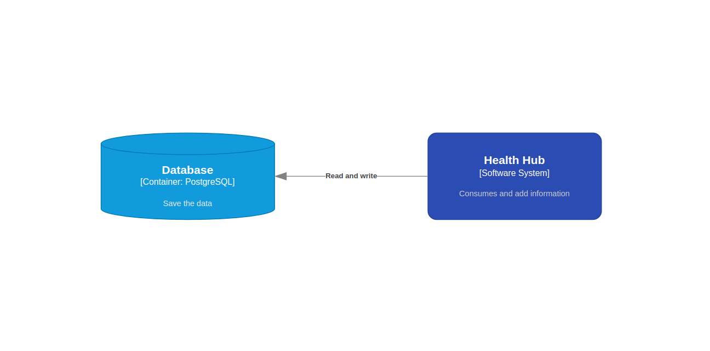
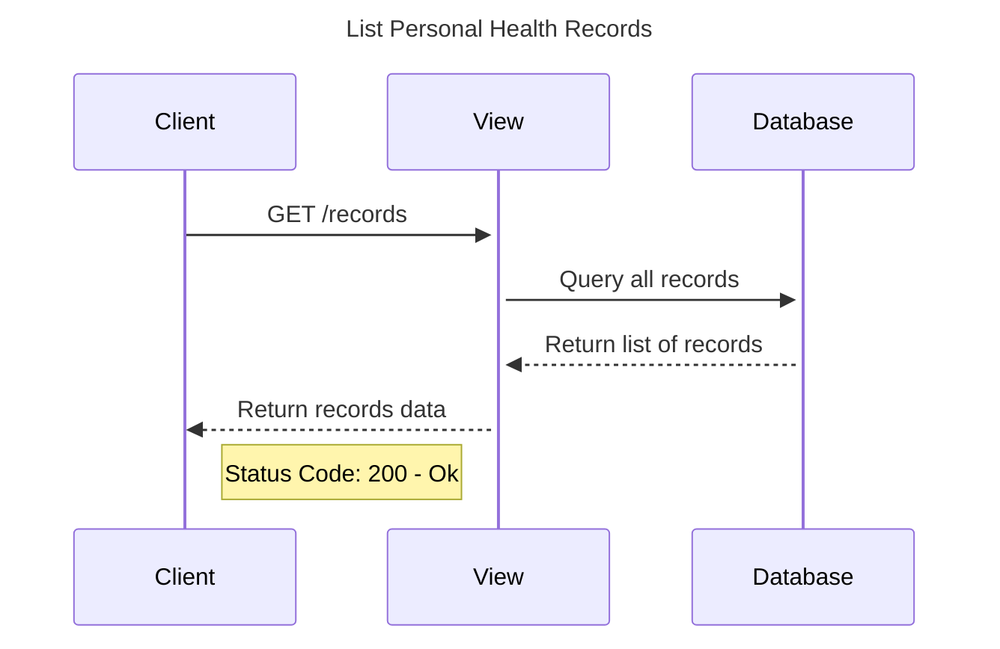
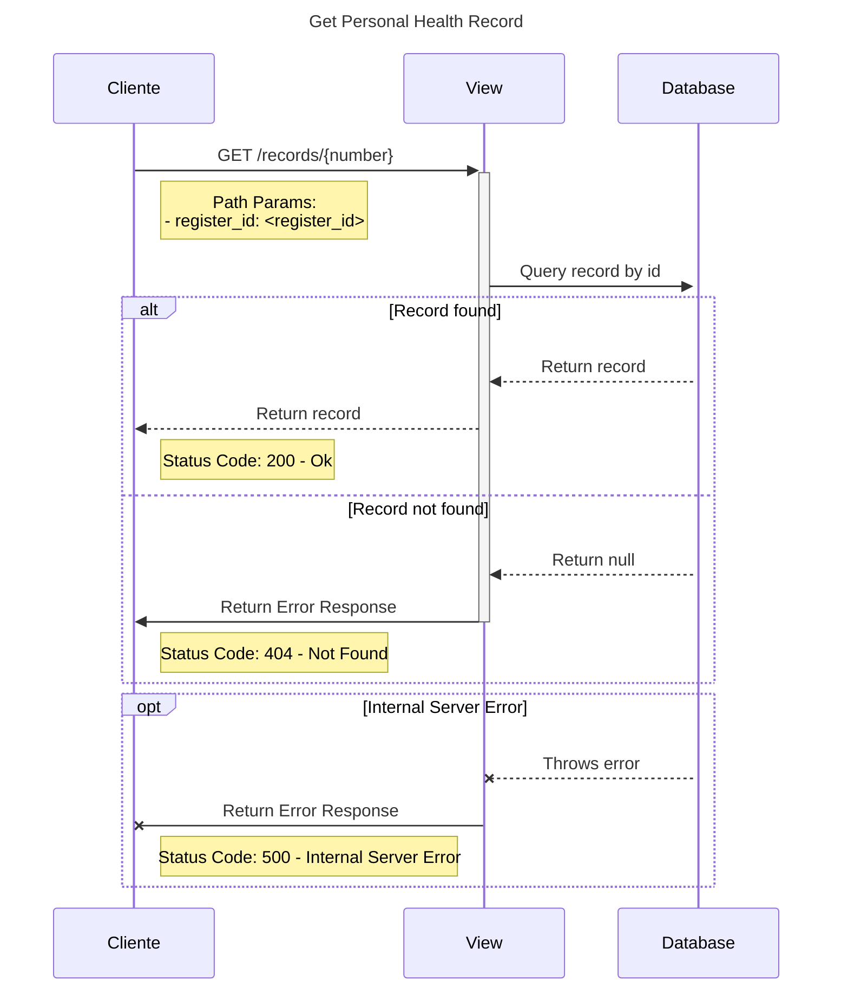
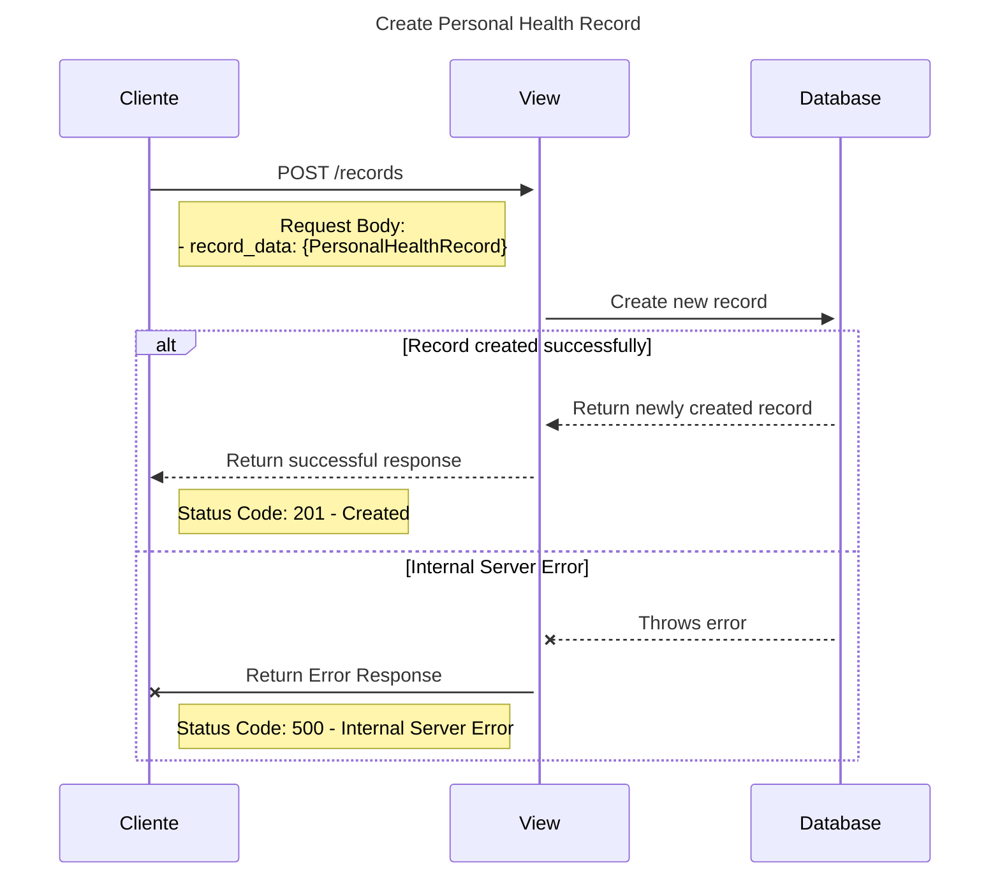
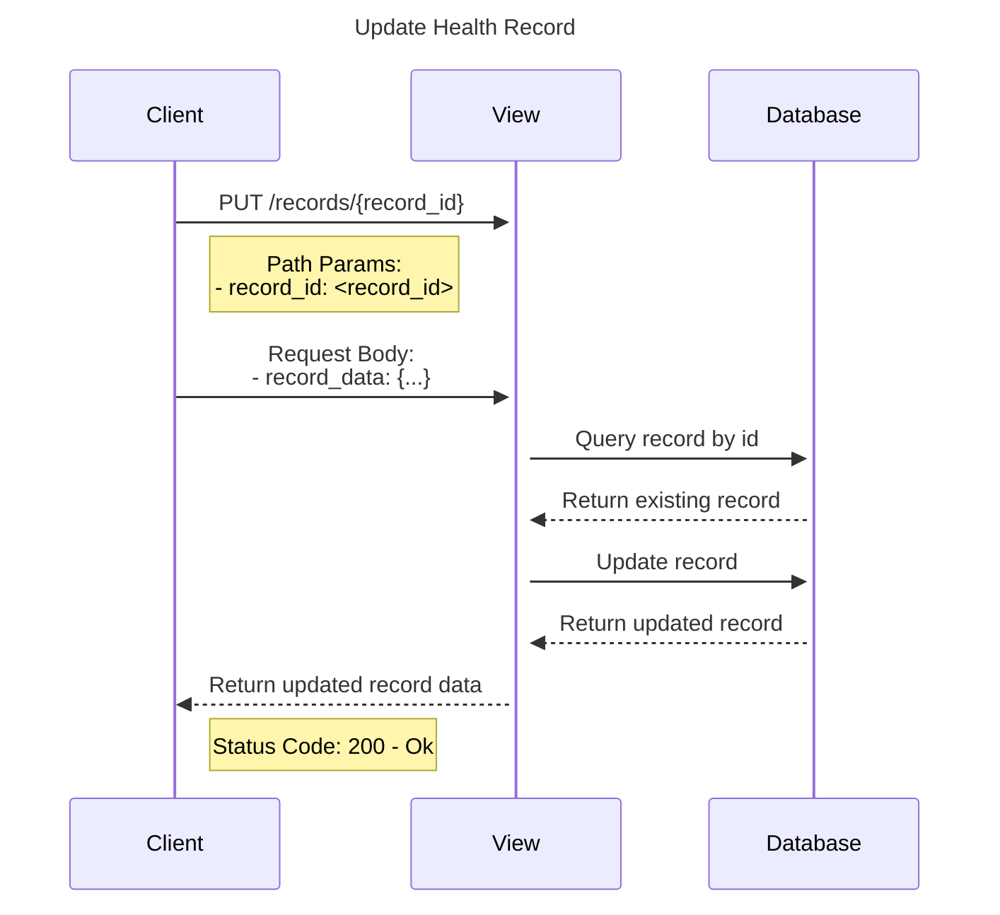
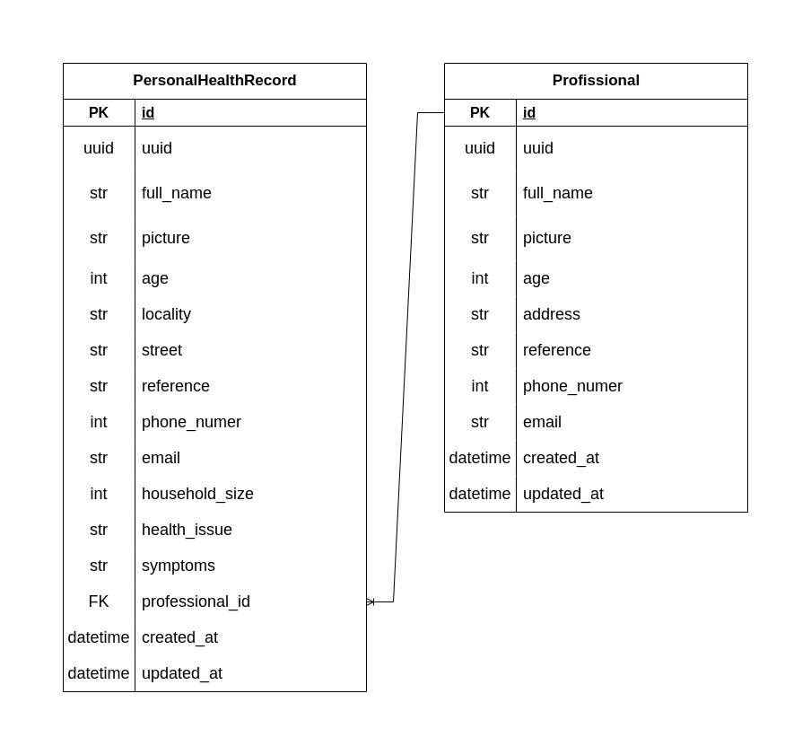

# Health Hub

## Resumo
Este documento traz informações do desenvolvimento de um serviço (website)
capaz de armazenar registros de informações de saúde de uma comunidade.

## Objetivo
Essa aplicação tem como objetivo principal ajudar profissionais de saúde a gerenciar os dados de seus pacientes de maneira mais simplificada e eficiente.

## O que é?
Uma aplicação que:
- armazena e disponibiliza informações.

## O que não é?
Uma aplicação que:
- se comunica com serviços externos.

## Solução Proposta
Desenvolvimento de uma aplicação web com interface intuitiva e amigável, projetada para armazenar de forma segura e acessível as informações de saúde dos pacientes, de modo que o profissional responsável seja capaz de fazer análises prévias que o ajudarão no atendimento antes mesmo do encontro com o paciente. O site disponibilizará sistemas de login para que cada profissional tenha sua área própria restrita e de gerenciamento.

### Arquitetura

## Diagramas de sequência

#### Diagrama de listagem de registros

#### Diagrama de detalhe de um registro

#### Diagrama de postagem de um registro

#### Diagrama de atualização de um registro

### Banco de dados

## Exemplo de payloads
...
